## Checklist escursione



La checklist viene generata automaticamente per ogni sessione in stato `PLANNED` a partire dai dati del sentiero SAT e, opzionalmente, dalle previsioni meteo.

### Endpoint

| Metodo | Path | Descrizione |
|--------|------|-------------|
| `POST` | `/api/v1/sessions/:id/checklist` | Genera la checklist (solo creator) |
| `PUT` | `/api/v1/sessions/:id/checklist` | Rigenera con meteo aggiornato |
| `GET` | `/api/v1/sessions/:id/checklist` | Legge la checklist (tutti i partecipanti) |

### Body (POST e PUT)

```json
{
  "sentieroCode": "E131",
  "locationId": "uuid-location-meteo",
  "partenza": "2026-06-15T07:00:00Z"
}
```

Tutti i campi sono opzionali:
- `sentieroCode` — se assente, viene usato `session.sentieroCode` salvato sulla sessione. Per sessioni GPX senza codice SAT, la checklist viene generata dai dati GPX (distanza, dislivello, durata)
- `locationId` — se assente, la checklist viene generata senza dati meteo
- `partenza` — se assente, si assume la `meetingDate` della sessione alle 08:00 UTC

### Struttura della checklist

Gli item sono raggruppati per categoria (`Abbigliamento`, `Attrezzatura`, `Sicurezza`, `Alimentazione`) e livello di priorità:

- `base` — indispensabile, senza questo non si parte
- `consigliato` — fortemente raccomandato in base al contesto
- `opzionale` — utile ma non critico

Ogni item include un campo `motivo` che spiega all'utente perché quell'oggetto è nella lista.

### Logica di generazione

I fattori considerati sono:

- **Difficoltà CAI** (`T`, `E`, `EE`, `EEA`) — determina tipo di calzature, necessità di casco, imbragatura, piccozza
- **Quota massima** — sopra i 2000 m si aggiungono strati isolanti e protezione UV; sopra i 2800 m o con zero termico vicino alla quota si aggiungono ramponi e piccozza
- **Meteo** — pioggia ≥ 40% aggiunge impermeabile in `base`; vento ≥ 50 km/h aggiunge antivento in `consigliato`; temperatura < 5°C aggiunge pile; neve fresca > 5 cm aggiunge ramponi
- **Durata** (`tempoAndata`) — calcola acqua in litri e fabbisogno calorico stimato

### Freeze

La checklist si congela alla **mezzanotte UTC del giorno prima** della `meetingDate`. Dopo il freeze qualsiasi chiamata `PUT` restituisce `403` con il timestamp di freeze. La data di freeze è esposta anche nel `GET` per permettere al client di mostrare il countdown.

---

## Filtri sentieri

L'endpoint `GET /api/v1/sentieri` supporta filtri server-side opzionali.

### Parametri

| Parametro | Tipo | Descrizione | Esempio |
|-----------|------|-------------|---------|
| `difficolta` | string | Difficoltà CAI esatta | `E` |
| `destinazione` | string | Nome destinazione (parziale, case-insensitive) | `Rifugio` |
| `dislivelloMax` | integer | Differenza quotaMassima - quotaMinima in metri | `800` |
| `distanzaMax` | integer | Distanza planimetrica massima in metri | `10000` |
| `tempoMax` | string | Tempo massimo di andata (formato `HH:MM`) | `03:30` |
| `limit` | integer | Numero massimo di risultati (default 100) | `50` |

### Esempio

```
GET /api/v1/sentieri?difficolta=E&dislivelloMax=800&distanzaMax=10000&tempoMax=03:30
```