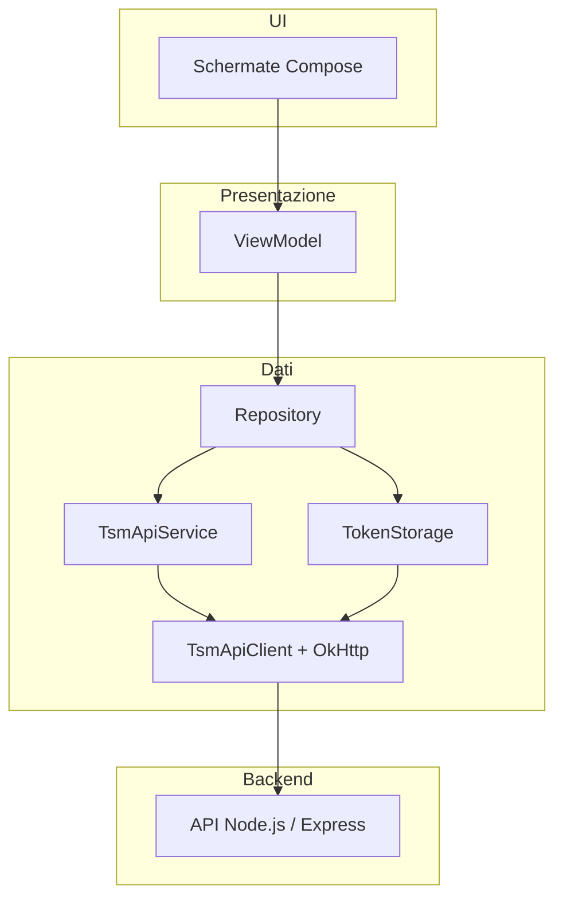

# Comunicazione app Android ↔ server backend

Documento di riepilogo per il team: **come l’app Android parla con il backend Node.js** oggi, quali file toccare e come configurare l’ambiente di sviluppo.

Per la struttura generale del modulo `mobile/` e il flusso UI (auth, tab principali) vedi anche [`mobile_app_base.md`](mobile_app_base.md). Per Android Studio e Gradle vedi [`setup_mobile.md`](setup_mobile.md).

---

## In sintesi

L’app **non** chiama il server dalle schermate Compose. Il percorso è:

**Schermata → ViewModel → Repository → Retrofit (`TsmApiService`) → backend Express**

- **Retrofit** definisce le route HTTP e deserializza JSON (Gson).
- **OkHttp** gestisce timeout, log di base e l’header `Authorization` tramite `AuthInterceptor`.
- **Repository** traducono risposte ed errori in tipi usati dalla UI (successo / messaggio utente).
- Il **JWT** dopo il login resta in locale (`TokenStorage`); le chiamate protette lo riusano automaticamente.

---

## Flusso a strati

| Strato | Cartella / file | Ruolo |
| --- | --- | --- |
| Contratto HTTP | `mobile/app/src/main/java/.../data/remote/TsmApiService.kt` | Annotazioni Retrofit (`@POST`, `@GET`, path, body). |
| Modelli JSON | `.../data/remote/dto/` | Request/response allineate al backend (`LoginRequest`, `UserResponse`, `ApiMessageBody`, …). |
| Client | `.../data/remote/TsmApiClient.kt` | Costruisce Retrofit con `BuildConfig.BASE_URL`, Gson, timeout. |
| Auth HTTP | `.../data/remote/AuthInterceptor.kt` | Se esiste un JWT in `TokenStorage`, aggiunge `Authorization: Bearer <token>`. |
| JWT locale | `.../data/local/TokenStorage.kt` | Salva / legge / cancella il JWT in **EncryptedSharedPreferences** (`tsm_auth_encrypted`); migrazione one-shot da `tsm_auth` legacy. |
| Sessione all’avvio | `.../data/local/AuthSession.kt` + `TsmNavHost` | Se il JWT locale ha `userId` e `exp` futuro → `Routes.MAIN`, altrimenti auth. |
| Lettura `userId` | `.../data/remote/JwtDecoder.kt` | Decodifica il payload JWT (solo per ottenere `userId`, senza verificare la firma lato app). |
| Logica API | `.../repository/*RepositoryImpl.kt` | Chiamano `TsmApiService`, gestiscono errori di rete e body di errore JSON. |
| Stato UI | `.../viewmodel/*ViewModel.kt` | Validazione locale, loading, messaggi; usano i repository. |
| Avvio client | `.../TsmApplication.kt` | In `onCreate()` chiama `TsmApiClient.init(TokenStorage(this))` prima di qualsiasi chiamata. |

Le schermate (`ui/screens/...`) osservano lo stato del ViewModel; **non** importano Retrofit direttamente.

---

## Avvio dell’app e client HTTP

1. Android avvia `TsmApplication`.
2. `TsmApiClient.init(TokenStorage)` crea un’unica istanza Retrofit con:
   - `baseUrl` = `BuildConfig.BASE_URL`
   - interceptor `AuthInterceptor` (Bearer se presente)
   - interceptor di log OkHttp (livello BASIC, utile in debug)
   - timeout connessione/lettura 30 secondi
3. Repository e ViewModel ottengono il contratto API con `TsmApiClient.service()`.

Se `init` non è stato chiamato, `service()` fallisce con un messaggio esplicito: il client va sempre inizializzato dall’`Application`.

---

## Dove si configura l’URL del server

L’URL base **non** è hardcoded nel codice Kotlin: viene iniettato in build come `BuildConfig.BASE_URL` da `mobile/app/build.gradle.kts`.

Ordine di priorità:

1. proprietà Gradle `TSM_API_BASE_URL` (se impostata)
2. `tsm.api.baseUrl` in `mobile/local.properties` (file locale, di solito non versionato)
3. default per **emulatore**: `http://10.0.2.2:3000/` (`10.0.2.2` = localhost del PC visto dall’emulatore)

Dopo ogni modifica a `local.properties` o alla proprietà Gradle serve **ricompilare** l’app (rebuild / reinstall), perché `BASE_URL` è generato a compile-time.

### Emulatore vs telefono fisico

| Ambiente | Configurazione tipica |
| --- | --- |
| Emulatore Android | Default `http://10.0.2.2:3000/`; backend in ascolto su `localhost:3000` sul PC. |
| Telefono USB + `adb reverse` | In `local.properties`: `tsm.api.baseUrl=http://127.0.0.1:3000/`; sul PC: `adb reverse tcp:3000 tcp:3000`. |
| Telefono sulla stessa LAN | `tsm.api.baseUrl=http://<IP-LAN-del-PC>:3000/`; host consentito in `network_security_config.xml` per HTTP in sviluppo. |

L’app richiede il permesso `INTERNET` nel manifest. In sviluppo, HTTP verso host locali è gestito da `network_security_config.xml` (in produzione si userà HTTPS).

---

## API usate oggi

Contratto in `TsmApiService.kt` (path relativi a `BASE_URL`):

| Metodo | Route | Autenticazione | Repository | ViewModel / schermata |
| --- | --- | --- | --- | --- |
| `POST` | `auth/login` | No | `AuthRepositoryImpl` | `LoginViewModel` → login |
| `POST` | `users` | No | `RegistrationRepositoryImpl` | `RegisterViewModel` → registrazione |
| `GET` | `users/{id}` | Sì (Bearer) | `ProfileRepositoryImpl` (Room + rete) | `ProfileViewModel` → tab Profilo |

### Login

1. L’utente invia email e password; il ViewModel valida i campi.
2. `AuthRepositoryImpl` chiama `api.login(LoginRequest)`.
3. Se la risposta è 2xx e il body contiene `token`, il JWT viene salvato con `TokenStorage.saveToken`.
4. In caso di **403** (email non verificata), il repository espone `LoginResult.EmailNotVerified` e la UI mostra un avviso dedicato; altri errori HTTP leggono `message` da `ApiMessageBody` se presente.
5. `IOException` → messaggio di server irraggiungibile (backend spento o URL errato).
6. Dal flusso post-registrazione, `Routes.loginRoute(pendingEmail)` può precompilare l’email e mostrare un promemoria di verifica.

### Registrazione

1. `RegistrationRepositoryImpl` invia `RegisterRequest` a `POST /users`.
2. Successo (201) → parsing di `{ message, user }`; navigazione a **Verifica email** con l’indirizzo dell’utente creato; conflitto (es. 409) o `message` dal server → errore in UI.
3. La password viaggia nel body come definito dal backend (hash lato server). Il login resta bloccato finché l’utente non apre il link **`GET /auth/verify/:token`** (di solito dal client email / browser).

### Profilo (username)

1. `ProfileRepositoryImpl` legge il JWT da `TokenStorage` e `userId` da `JwtDecoder`.
2. Emissione iniziale da **Room** (`ProfileDao`, tabella `cached_user_profile`) se esiste uno snapshot precedente.
3. Chiamata `api.getUserById(userId)`; in caso di successo **`upsert`** in Room e aggiornamento UI.
4. In caso di errore di rete o HTTP, se esiste cache locale si mantiene l’username con messaggio esplicativo.

Il **logout** cancella il token (`TokenStorage.clearToken()`), svuota la tabella profilo (`ProfileDao.deleteAll()`) e riporta al flusso auth.

---

## Gestione errori e JSON

Pattern comune nei repository:

- **Successo**: `response.isSuccessful` e body atteso presente.
- **Errore HTTP**: lettura di `errorBody()`; se il backend manda `{ "message": "..." }`, parsing con Gson su `ApiMessageBody`.
- **Rete**: `IOException` → messaggio che invita a controllare backend avviato e `BuildConfig.BASE_URL`.

I ViewModel espongono stati (caricamento, errore, successo) alla UI senza esporre dettagli Retrofit.

---

## Cosa non fa l’app (limiti attuali)

- **Nessun segreto del server** nell’APK: solo URL base e chiamate pubbliche/protette come da API.
- **Nessuna verifica crittografica del JWT** in app: il token serve a identificare l’utente e a chiamare endpoint protetti; la validità è demandata al backend.
- **Nessun refresh token** automatico; la sessione all’avvio si basa sul JWT salvato e sul controllo locale di `exp` (la firma resta demandata al backend).
- **Nessun deep link** dall’email di verifica verso l’app; la conferma passa dal link HTTP del backend.
- **`android:allowBackup="false"`** nel manifest: il JWT cifrato non entra nei backup di sistema.

Variabili come `JWT_SECRET` e SMTP restano nel **`backend/.env`** (copia locale dal documento condiviso dal team). Senza backend configurato, login e registrazione possono fallire per motivi lato server anche se l’URL dell’app è corretto.

---

## Aggiungere una nuova chiamata API

1. **Backend**: route e contratto JSON stabili (o allineati al team backend).
2. **`TsmApiService`**: nuovo metodo con verbo HTTP, path e `@Body` / `@Path` / query se servono.
3. **`dto/`**: classi request/response se non riusabili.
4. **Repository** (interfaccia + `*Impl`): una funzione suspend che chiama il service e mappa esito/errore.
5. **ViewModel**: stato UI e invocazione del repository.
6. **Schermata**: solo binding allo stato del ViewModel.

Se l’endpoint è **protetto**, non serve duplicare l’header: basta che il JWT sia in `TokenStorage` dopo il login. Per endpoint **pubblici**, il repository non deve dipendere dal token salvo casi particolari.

Dopo cambi all’URL o alle dipendenze di rete, ricompilare e verificare con backend locale (`npm run dev` nella cartella `backend/`).

---

## Riferimenti rapidi nel repository

| Argomento | Percorso |
| --- | --- |
| Contratto REST | `mobile/app/src/main/java/it/trentosmartmountain/app/data/remote/TsmApiService.kt` |
| Client Retrofit | `mobile/app/src/main/java/it/trentosmartmountain/app/data/remote/TsmApiClient.kt` |
| Bearer automatico | `mobile/app/src/main/java/it/trentosmartmountain/app/data/remote/AuthInterceptor.kt` |
| URL in build | `mobile/app/build.gradle.kts` → `BuildConfig.BASE_URL` |
| Database Room | `mobile/app/src/main/java/.../data/local/db/TsmDatabase.kt` |
| DAO profilo | `mobile/app/src/main/java/.../data/local/db/ProfileDao.kt` |
| Init applicazione | `mobile/app/src/main/java/it/trentosmartmountain/app/TsmApplication.kt` |

---

*Documento per il team Trento Smart Mountain — comunicazione mobile ↔ server.*
